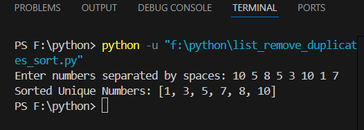
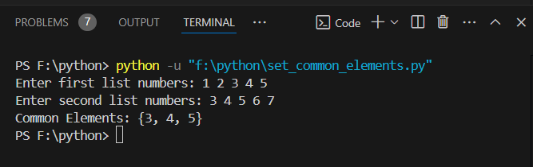

Task 01:  List:Given a list of numbers, remove duplicates and sort in ascending order.

Task 02: Set: Find the common elements between two lists using sets.

Task 03: Tuple: Create a tuple of student records (name, age, grade) and sort by grade.

Task 04: Dictionary: Count word occurrences in a given text and store them in a dictionary.

Task 05: NumPy#1: Generate a 5x5 matrix of random integers and compute row-wise sums.

Task 06: NumPy#2: Create an array of 100 random values and normalize them between 0 and 1.

Task 07: Pandas#1: Load a CSV file of sales data and compute total revenue per product.

Task 08: Pandas#2: Fill missing values in a dataset with column-wise means.

Task 09: Matplotlib#1: Plot a line graph showing temperature variations over a week.

Task 10: Matplotlib#2: Create a bar chart comparing sales revenue across different regions.

